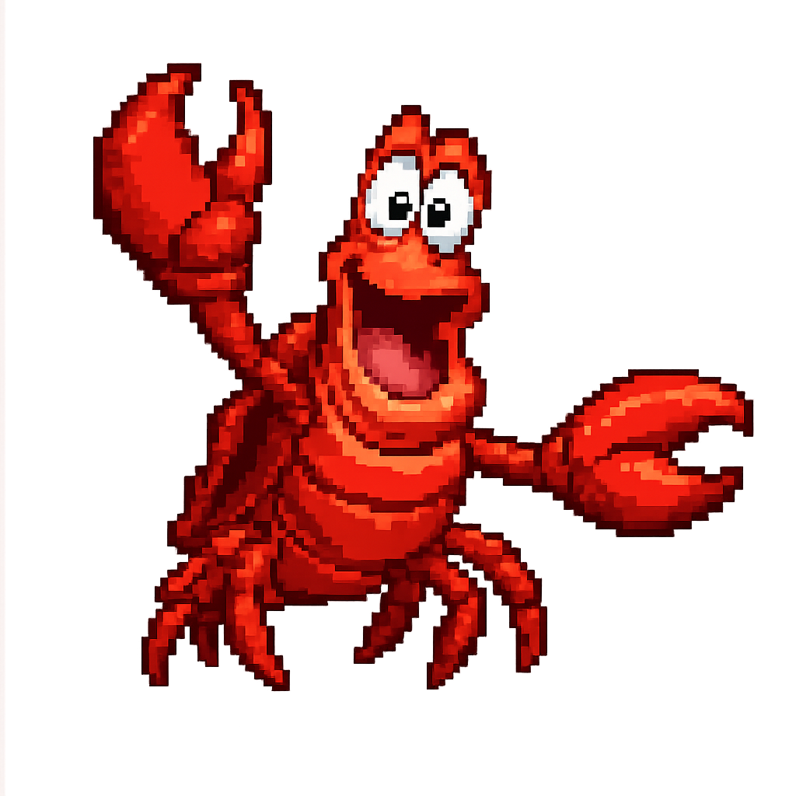

# sebastian

<p align="center">
  
</p>

A pixel-perfect Rust port of the [mermaid.js](https://mermaid.js.org)
diagram renderers (mermaid 11.15.0). Named after Sebastian, the crab
from Disney's *The Little Mermaid* — a fitting mascot for a
mermaid renderer. For supported diagram types — **flowchart, stateDiagram-v2,
sequenceDiagram, classDiagram, timeline, pie, erDiagram, xychart-beta,
gantt, gitGraph, journey, quadrantChart, packet, radar, sankey, block** — the output SVG is
**byte-for-byte identical** to the official `mmdc` (mermaid-cli) output.

The workspace contains two crates:

- **`sebastian`** — the rendering library (`sebastian::render_diagram`)
- **`seb`** — the CLI

```
cargo run -p seb -- -i diagram.mmd -o diagram.svg
```

Run `seb` with no arguments (or `seb --logo`) to print the sebastian logo
as true-color terminal art, rendered from `sebastian/resources/LOGO.png`
via the [`logo-art`](https://crates.io/crates/logo-art) crate.

The non-obvious Chrome/V8/mermaid behaviors this required are cataloged
in [docs/NUANCES.md](docs/NUANCES.md).

## Status

Every "done" row is verified by a corpus test that byte-diffs sebastian's
output against captured `mmdc` (mermaid 11.15.0) SVGs; the count is the
number of fixtures under `sebastian/tests/`. "Byte-exact modulo …" means
the only differences come from randomness or render-time state that
mermaid itself embeds, so no port can match those bytes.

| Diagram type | Status | Fixtures | Notes |
|---|---|---:|---|
| flowchart / graph | ✅ done | 553 + 14 | 544/553 corpus byte-identical; remainder is rough.js randomness and sub-0.01px arc noise |
| sequenceDiagram | ✅ done | 37 | blocks, activations, autonumber, boxes, actor figures |
| stateDiagram-v2 | ✅ done | 29 | 23 byte-exact, 6 modulo rough.js + random divider id |
| classDiagram | ✅ done | 9 | byte-exact modulo rough.js rectangle/divider randomness |
| gantt | ✅ done | 5 | byte-exact modulo the render-time today marker |
| timeline | ✅ done | 4 | byte-exact |
| pie | ✅ done | 4 | byte-exact |
| erDiagram | ✅ done | 3 | byte-exact modulo rough.js randomness |
| xychart-beta | ✅ done | 3 | byte-exact |
| gitGraph (`LR`) | ✅ done | 3 | byte-exact modulo random commit ids + 1-ulp viewBox |
| journey | ✅ done | 3 | byte-exact |
| quadrantChart | ✅ done | 3 | byte-exact |
| packet / packet-beta | ✅ done | 3 | byte-exact |
| radar / radar-beta | ✅ done | 3 | byte-exact |
| sankey / sankey-beta | ✅ done | 3 | byte-exact (labels-within-bounds; getBBox ignores text) |
| block / block-beta | ✅ done | 12 | byte-exact (columns, space, spans, composites, classDef/style, edges incl. labels) |
| gitGraph (`TB` / `BT`) | ❌ not started | — | only the `LR` orientation is ported |
| flowchart ELK layout | ❌ not started | — | `defaultRenderer: elk`; a large engine port, scoped below |
| mindmap / architecture | ❌ not planned | — | force layouts (cose-bilkent / cytoscape), non-deterministic |
| C4, kanban, requirement, treemap | ❌ not planned | — | no corpus demand yet; revisit when fixtures show up |

## How to help

The porting loop is mechanical once you have the reference output, and it
is the same loop that got every ✅ row to byte-exact (details in
[PORTING_NOTES.md](PORTING_NOTES.md)):

1. Harvest real diagrams of the target type into a `tests/<type>_cases/`
   directory as `.mmd` files.
2. Render each with `mmdc` (mermaid 11.15.0, headless Chrome on macOS) to
   capture the reference SVGs.
3. Byte-diff sebastian's output against the reference and chase the first
   differing byte until the diff is empty.
4. Add a corpus test with an identical-count guard so regressions surface.

The highest-leverage contributions right now:

- **Verify `quadrantChart`.** It already renders; it needs a fixture
  corpus and the byte-diff pass to promote it from experimental to done.
- **gitGraph `TB`/`BT` orientations.** The `LR` renderer is a starting
  point; the vertical layouts reuse most of it.
- **Flowchart ELK layout** (`defaultRenderer: elk`) — the big one, scoped
  in the section below.

If a diagram type you need is missing, opening a PR with `.mmd` fixtures
and their `mmdc` references is the most useful first step even before any
Rust is written.

## What is ported

The full flowchart pipeline, ported line-by-line from the JS sources:

- **Parser** — `flow.jison` grammar + `flowDb` semantics: all node shapes
  (`[]`, `()`, `(())`, `((()))`, `{}`, `{{}}`, `([])`, `[[]]`, `[()]`, `>]`,
  `[//]`, `[\\]`, trapezoids), edge types (`-->`, `===`, `-.->`, `~~~`,
  `o--o`, `x--x`, `<-->`, labels, lengths), subgraphs (nested, with
  `direction`), `classDef`/`class`/`:::`/`style`/`linkStyle`.
- **Layout** — the dagre engine exactly as bundled in `dagre-d3-es` 7.0.14:
  network-simplex ranking, crossing minimization, Brandes-Köpf positioning,
  compound/cluster handling, plus mermaid's `mermaid-graphlib` cluster
  extraction. Validated by differential tests against the JS implementation
  (exact float equality).
- **Text metrics** — Chrome-accurate label measurement using the system
  Trebuchet MS font (advances + kerning, LayoutUnit rounding, 200px
  word-wrapping), required for identical node sizes.
- **SVG generation** — d3 `curveBasis` edges with marker offsets, the exact
  default-theme stylesheet, `classDef` CSS (CSSOM serialization), markers
  (including per-color clones), clusters, self-loop decomposition, rough.js
  two-path shapes (stadium, odd), foreignObject HTML labels (or SVG
  `<text>` labels when `htmlLabels: false`, see below), and Chrome
  `XMLSerializer`/`getBBox` semantics (f32 quantization, attribute ordering,
  DOMPurify trimming).

## Label rendering (`htmlLabels`)

Mermaid renders labels two ways, and this port matches both byte-for-byte:

- **`htmlLabels: true`** (the default) — labels are `foreignObject` HTML
  spans, exactly as `mmdc` emits them. Faithful, but `foreignObject`
  requires an HTML/CSS layout engine (a browser) to rasterize.
- **`htmlLabels: false`** — node, edge, and cluster labels become native
  SVG `<text>`/`<tspan>` (mermaid's `createFormattedText` path; node text is
  centered via the `.node .label text { text-anchor: middle }` rule), and
  `classDef` styling targets the shape elements (`rect`/`polygon`/`ellipse`/
  `circle`/`path`) instead of the foreignObject contents. This output
  rasterizes in pure-SVG renderers such as
  [resvg](https://github.com/linebender/resvg) that don't support
  `foreignObject`, which makes offline SVG → PNG conversion possible without
  a headless browser.

Select it with an init directive — `%%{init: {'htmlLabels': false,
'flowchart': {'htmlLabels': false}}}%%` — or the merged config.

## Hand-drawn look (`look: handDrawn`)

`%%{init: {'look': 'handDrawn'}}%%` turns on an Excalidraw-style look:
flowchart node shapes (rectangles, rounded rectangles, diamonds, circles)
and edges are drawn with sketchy, double-stroked outlines, and labels switch
to a handwritten font stack (`"Comic Sans MS", "Chalkboard SE", "Bradley
Hand", cursive`).

Unlike the classic look, this is an **opt-in stylization, not byte-exact**.
Upstream mermaid draws hand-drawn shapes with rough.js seeded from
`Math.random`, so two `mmdc` runs of the same diagram differ. sebastian
instead uses a deterministic seeded PRNG (a port of rough.js's `mulberry32`),
so its hand-drawn output is stable run to run. Layout still uses the
Trebuchet metrics, so node sizes match the classic look while the rendered
font is handwritten (sizes are therefore approximate). Pairs naturally with
`htmlLabels: false` for offline rasterization.

### Sequence diagrams (sebastian extension)

Hand-drawn support for **sequence diagrams** is a sebastian-specific extension
with **no upstream equivalent** — mermaid's legacy sequence renderer
(`sequenceRenderer.ts` + `svgDraw.js`) ignores `look` and always draws crisp
shapes. When `look: handDrawn` is set, sebastian routes the sequence diagram's
actor boxes, footer boxes, note boxes, straight message lines, and loop/alt
borders through the same sketchy primitives the flowchart uses. By design it
leaves a few elements crisp: self-message bezier curves, the loop label tab,
the thin lifelines, and arrowhead markers. See
`sebastian/src/sequence/render.rs` (module docs) and
`sebastian/tests/sequence_handdrawn.rs`.

## Rasterization (PNG) — `raster` feature

The renderers return **SVG** by default. Enable the `raster` feature to also get
**PNG** via the `render::raster` module (pulls in resvg; off by default so
SVG-only consumers stay light):

- `render_png(source, id)` — mermaid source straight to PNG bytes.
- `rasterize_svg(svg, &RasterOptions)` — rasterize any SVG, with an optional
  background, an extra blank footer band, and an overlay SVG composited on top
  (e.g. a caller's watermark).
- `measure_svg(svg)` — the rendered pixel size, for sizing an overlay first.

Fonts are selected by `RasterOptions::fonts`:

- `FontSource::Embedded` (default) bundles **Cabin** (SIL OFL 1.1) and points
  every generic family at it, so the standard `trebuchet ms, …, sans-serif`
  stack falls through to Cabin. No installed fonts required; output is
  deterministic across machines.
- `FontSource::System` loads the system fonts and leaves family resolution to
  usvg, so `trebuchet ms` resolves to the installed face — **use this for
  pixel-perfect raster comparison against mermaid-cli**, whose Chrome renders the
  same stack.

```bash
cargo build --features raster
```

## Fidelity

Two reference suites assert output against captured `mmdc` SVGs:

- `sebastian/tests/flowchart_rendering.rs` — 14 hand-written diagrams (directions,
  subgraphs, self-loops, styling, unicode, wrapping, parallel edges, …),
  byte-identical.
- `sebastian/tests/book_corpus.rs` — 553 real-world flowcharts harvested from `.md`
  books. **544 are byte-identical**, including 17 with `%%{init}%%`
  directives (themes, themeVariables, `htmlLabels:false`); 3 contain
  rough.js shapes (compared modulo mermaid's own random control points);
  6 differ only numerically (5 below 0.01px from Chrome's
  arc-decomposition arithmetic, 1 at ≤2px from a space-kerning quirk).
- `sebastian/tests/flowchart_nohtml_rendering.rs` — 12 of the flowchart
  diagrams re-rendered with `htmlLabels: false` (SVG `<text>` labels),
  byte-identical. Two cases (`chain`, `multibr`) are omitted: they differ by
  ≤0.07px / 1 f32 ULP because Chrome sizes SVG-text nodes from glyph ink
  extents (`getBBox`) while this port uses advance widths — invisible when
  rasterized.
- `sebastian/tests/state_corpus.rs` — 29 stateDiagram-v2 diagrams (23
  byte-identical; 6 compared modulo mermaid's own rough-path randomness
  and its random divider `generateId()` token).
- `sebastian/tests/sequence_corpus.rs` — 34 sequence diagrams (blocks,
  activations, autonumber, boxes, actor figures), all byte-identical.
- `sebastian/tests/timeline_corpus.rs` — 4 timeline diagrams, all byte-identical.
- `sebastian/tests/pie_corpus.rs`, `sebastian/tests/er_corpus.rs`,
  `sebastian/tests/xychart_corpus.rs`, `sebastian/tests/gantt_corpus.rs` —
  pie, ER, xychart-beta, and gantt fixtures (byte-identical; ER modulo
  mermaid's rough randomness, gantt modulo the render-time today marker).
- `sebastian/tests/class_corpus.rs` — 9 class diagrams (generics, notes,
  namespaces, lollipop interfaces), byte-identical modulo the rough
  rectangle/divider randomness mermaid itself embeds.
- `sebastian/tests/gitgraph_corpus.rs` — 2 gitGraphs (`LR`), byte-identical
  modulo the `Math.random()`-seeded auto-generated commit ids and a
  single-f32-ulp viewBox difference in Blink's rotated-rect bbox mapping.
- `sebastian/tests/journey_corpus.rs` — 2 user-journey diagrams, all
  byte-identical.

Reproducing the corpus required matching Chrome's text pipeline in detail:
HTML-entity decoding via innerHTML semantics, DOMPurify tag/attribute
stripping, `\n` → `<br />` conversion, the CoreText font-fallback cascade
(Lucida Grande, Arial Unicode, Helvetica for sub/superscripts, Apple Symbols
for math operators, Hiragino for box-drawing, Apple Color Emoji at 1.25em),
per-`font-size` label measurement, and Chrome's line-breaking rules (UAX #14
hyphen breaks, open-bracket breaks after non-alphanumerics, table min-content
expansion).

The one known exception: shapes drawn through rough.js (stadium `([])`, odd
`>]`) embed *random* curve parameterization in mermaid itself — two `mmdc`
runs of the same diagram differ in those bytes. The geometry is identical
(control points are collinear); rasterized comparison shows this port is
within mermaid's own run-to-run antialiasing variance (≈0.01% of channel
bytes).

## Requirements

- The Trebuchet MS font (preinstalled on macOS and Windows) — text metrics
  and therefore the entire layout depend on it.

## Flowchart ELK layout (not started)

`%%{init: {"flowchart": {"defaultRenderer": "elk"}}}%%` routes layout
through elkjs, a 1.5 MB GWT transpilation of the Java ELK *layered* engine
(network-simplex layering, Forster-constrained crossing minimization, ELK's
modified Brandes-Köpf placement, orthogonal edge routing, port constraints).
The mermaid glue (`@mermaid-js/layout-elk`, ~1.3k lines) is small; the
engine is the real work — a port larger than the original dagre port, best
done from the readable Java sources (`eclipse/elk`) with differential
fixtures in its own multi-session effort.

## Development

- `cargo test` — unit tests, dagre differential fixtures, byte-exact
  rendering tests.
- `/tmp`-based reference tooling and porting details: see `PORTING_NOTES.md`.
